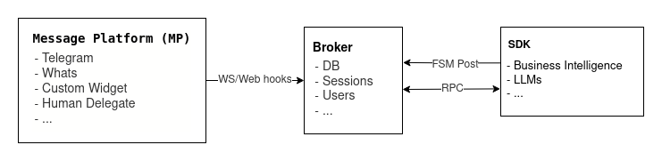

.. ChatFAQ documentation master file, created by
   sphinx-quickstart on Tue Feb  7 11:59:37 2023.
   You can adapt this file completely to your liking, but it should at least
   contain the root `toctree` directive.

ChatFAQ's documentation
===================================

ChatFAQ is an open-source comprehensive platform for creating a wide variety of chatbots: generic ones, business-trained, or even capable of redirecting requests to human operators.

The system is comprised of three main components that you need to install:

- :ref:`The back-end <back-end's documentation>` manages client-to-messaging platform connections and session storage. It also houses the database storing all Finite State Machine (FSM) definitions, user information, and more.

- :ref:`The SDK <SDK's documentation>` serves two primary functions: it allows for the posting of new FSM definitions to ChatFAQ back-end server, and it also launches a Remote Procedure Call (RPC) server to execute transitions and events from the posted FSM definitions.

- :ref:`The messaging platform (MP) <Widget's documentation>` is the client application where the user interacts with the bot. Examples of MP include platforms such as WhatsApp, Telegram, Facebook Messenger, or a custom interface.

Contents
--------------------------

.. toctree::

   back-end docs <modules/back/index.rst>
   SDK docs <modules/sdk/index.rst>
   Widget docs <modules/widget/index.rst>
