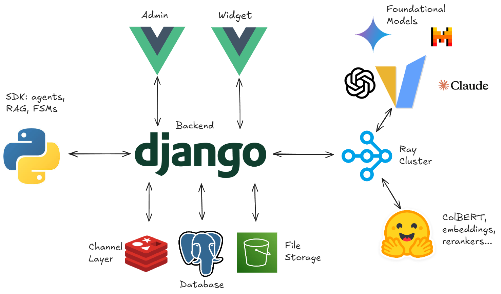

# Introduction

## Installation

The system comprises three main components that you need to install:

- The back-end ([install](./modules/back/index.rst)) manages the comunication between all the components. It also houses the database for storing all the data related to the chatbots, datasets, models, etc...

- The SDK ([install](./modules/sdk/index.rst)) launches a Remote Procedure Call (RPC) server to execute transitions and events from the posted FSM definitions.

- The widget ([install](./modules/widget/index.rst)) is a JS browser client application from which the user interacts with the bot.

## Quick Start

Although ChatFAQ is designed extensible and flexible to be able to modify its core functionality, it is also designed to be easy to use.

Therefore if you want to get started quickly, after installing the three main components mentioned above, you can set up your own RPC server which will define and execute the FSMs for your chatbot.
