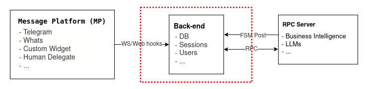
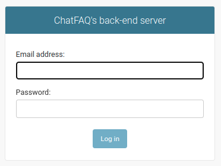

.. ChatFAQ documentation master file, created by
   sphinx-quickstart on Mon Jan 16 12:29:01 2023.
   You can adapt this file completely to your liking, but it should at least
   contain the root `toctree` directive.

back-end's documentation
===================================

Setting it up Locally
---------------------

Prerequisites
~~~~~~~~~~~~~

- Python 3.10
- python3.10-dev
- python3.10-distutils
- PostgreSQL
- gdal-bin
- poetry

Installation
~~~~~~~~~~~~

Navigate inside :code:`./back`

.. module:: back

Create a :code:`.env` file with the needed variables set. You can see an example of those on the :ref:`.env_example <back_env_example>` file

.. literalinclude:: ../../../../back/.env_example

Make sure Poetry is using the right Python executable. You have two options for this:

    1. If you have the Python executable in your PATH, Poetry will create the virtual environment for you:

    .. code-block:: console

        poetry env use python3.10

    2.- Alternatively, you could use  an environment created with another tool, such as Pyenv or Virtualenv

    .. code-block:: console

        poetry env use /full/path/to/virtualenv/python

Install project dependencies:

.. code-block:: console

    poetry install

Create a "chatfaq" database in PostgreSQL

.. code-block:: console

    sudo -u postgres psql -c "CREATE DATABASE chatfaq"

Create a "chatfaq" user in PostgreSQL

.. code-block:: console

    sudo -u postgres psql -c "CREATE user chatfaq WITH encrypted password 'chatfaq';"

Give the newly created user the necessary privileges

.. code-block:: console

    sudo -u postgres psql -c "grant all privileges on database chatfaq to chatfaq;"

Apply django migrations

.. code-block:: console

    poetry run ./manage.py migrate

Create a superuser

.. code-block:: console

    poetry run ./manage.py createsuperuser

When creating the superuser, it will ask if it belongs to the RPC group; it is critical to answer "yes" (y) so that later you can create an RPC Server with this same user

Apply fixtures

.. code-block:: console

    poetry run make apply_fixtures

Run the server

.. code-block:: console

    poetry run make run

Now you should be able to navigate to http://localhost:8000/back/admin

...and log in with your previously created user.

Setting it up with Docker
-------------------------

Prerequisites
~~~~~~~~~~~~~

- Docker
- docker-compose

Installation
~~~~~~~~~~~~

As simple as running

.. code-block:: console

    docker compose up

The containers generated will extract the environment variables from the ".env_docker" file.

Additionally, an admin user will be established with the credentials of "user=admin" and "password=admin", as specified in the same file."

:doc:`concepts`
---------------
