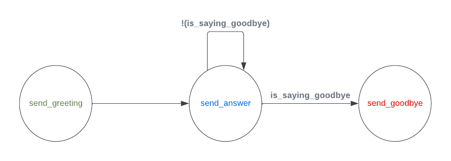

# SDK Documentation

For those chatbots with complex Finite State Machine (FSM) behaviours, you will probably want to run them on a separate process, that is what for the SDK is made for. Its primary function is to execute the FSM's computations (transition's conditions and states) by running Remote Procedure Call (RPC) server that listen to the back-end requests.

## Usage

### Simple example

This is just a dummy example that displays the basic usage of the library.

We are going to build the next FSM:



Import basic modules to build your first FMS:

```python
import os
import random
from chatfaq_sdk import ChatFAQSDK
from chatfaq_sdk.fsm import FSMDefinition, State, Transition
from chatfaq_sdk.conditions import Condition
from chatfaq_sdk.layers import Text
```

Declare the 3 possible states of our FSM:

```python
def send_greeting(ctx: dict):
    yield Text("Hello!")
    yield Text("How are you?", allow_feedback=False)

greeting_state = State(name="Greeting", events=[send_greeting], initial=True)


def send_answer(ctx: dict):
    last_payload = ctx["conv_mml"][-1]["stack"][0]["payload"]
    yield Text(
        f'My answer to your message: "{last_payload}" is: {random.randint(0, 999)}'
    )
    yield Text(f"Tell me more")

answering_state = State(
    name="Answering",
    events=[send_answer],
)


def send_goodbye(ctx: dict):
    yield Text("Byeeeeeeee!", allow_feedback=False)

goodbye_state = State(
    name="Goodbye",
    events=[send_goodbye],
)

```

Declare the only computable condition for the transitions of our FSM:

```python
def is_saying_goodbye(ctx: dict):
    if ctx["conv_mml"][-1]["stack"][0]["payload"] == "goodbye":
        return Condition(1)
    return Condition(0)
```

Now lets glue everything together:

Declare our transitions

```python
any_to_goodbye = Transition(dest=goodbye_state, conditions=[is_saying_goodbye])

greeting_to_answer = Transition(
    source=greeting_state,
    dest=answering_state,
    unless=[is_saying_goodbye],
)
answer_to_answer = Transition(
    source=answering_state, dest=answering_state, unless=[is_saying_goodbye]
)
```

Build the final instance of our FSM:

```python
fsm_definition = FSMDefinition(
    states=[greeting_state, answering_state, goodbye_state],
    transitions=[greeting_to_answer, any_to_goodbye, answer_to_answer],
)
```

Finally, run the RPC server loop with the previously built FSM:

```python
import os

sdk = ChatFAQSDK(
    chatfaq_retrieval_http="http://localhost:8000",
    chatfaq_ws="ws://localhost:8000",
    token=os.getenv("CHATFAQ_TOKEN"),
    fsm_name="my_first_fsm",
    fsm_definition=fsm_definition,
)
sdk.connect()
```

### Model example

All of that is great, but where is the large language model capabilities that ChatFAQ offers?

What if we want to build a FSM that makes use of a Language Model?

For that, you first need to [configure your model](../configuration/index.md).

Once you have configured all the components of the model, you will just need to reference the name of your RAG Configuration inside a state of the FSM.

For example, if you have a RAG Configuration named `my_rag_config`, you can use it inside a state like this:

```python
from chatfaq_sdk.fsm import FSMDefinition, State, Transition
from chatfaq_sdk.layers import LMGeneratedText, Text


def send_greeting(ctx: dict):
    yield Text("How can we help you?", allow_feedback=False)


def send_answer(ctx: dict):
    last_payload = ctx["conv_mml"][-1]["stack"][0]["payload"]
    yield LMGeneratedText(last_payload, "my_rag_config")

greeting_state = State(name="Greeting", events=[send_greeting], initial=True)

answering_state = State(
    name="Answering",
    events=[send_answer],
)

_to_answer = Transition(
    dest=answering_state,
)

fsm_definition = FSMDefinition(
    states=[greeting_state, answering_state],
    transitions=[_to_answer]
)
```

For the sake of completeness, here is the diagram of this FSM:


