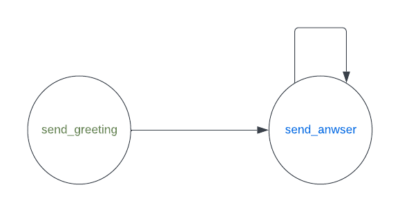

# Concepts

## Concepts

- <u>FSMDefinition</u>: Is the full description of a Finite State Machine.

An FSM (Finite State Machine) definition consists of two types of blocks: States and Transitions.

- <u>States</u>: A state in an FSM is a node that represents a specific condition. When a node is reached, its associated **events** are triggered. These events are executed on the demand of the ChatFAQ back-end server as Remote Procedure Calls (RPC).

- <u>Transitions</u>: Transitions define the **conditions** needed to move from one state to another. These conditions are executed on the demand of the ChatFAQ back-end server as Remote Procedure Calls (RPC).

Both **events** and **conditions** are functionality that is executed on demand by the ChatFAQ back-end server as RPCs. An RPC is a function that is executed remotely, and its results are returned to the caller.

## Example

Let's walk through a [simple example](https://github.com/ChatFAQ/ChatFAQ/blob/develop/sdk/examples/simple_example/fsm_definition.py) of the usage of the SDK.

The diagram below describes the FSM definition used in this example.


## States

Instantiate the **State** class for creating a new state in the SDK:

- Give it a **name**.
- If it's the initial state, set **initial** to `True`.
- Pass a list of **events** that should be triggered when it is entered.

```python
greeting_state = State(name="Greeting", events=[send_greeting], initial=True)
answering_state = State(name="Answering", events=[send_answer])
goodbye_state = State(name="Goodbye", events=[send_goodbye])
```

In this example, the FSM definition is composed of 3 states: **Greeting**, **Answering**, **Goodbye**.

The Greeting state is the initial state, all FSM definitions should have one and only one initial state.

All our 3 states have one event to trigger once entered:

- **Greeting** triggers `send_greeting`, which yields two Messages: a greeting and a question.
- **Answering** triggers `send_answer`, which yields two Messages: a customized answer based on the last message and an invitation to continue the conversation.
- **Goodbye** triggers `send_goodbye`, which yields a single Message saying goodbye.

```python
async def send_greeting(sdk: ChatFAQSDK, ctx: dict):
    yield Message("Hello!")
    yield Message("How are you?", allow_feedback=False)

async def send_answer(sdk: ChatFAQSDK, ctx: dict):
    last_payload = ctx["conv_mml"][-1]["stack"][0]["payload"]["content"]
    yield Message(
        f'My answer to your message: "{last_payload}" is: {random.randint(0, 999)}'
    )
    yield Message("Tell me more")

async def send_goodbye(ctx: dict):
    yield Message("Byeeeeeeee!", allow_feedback=False)
```

## Transitions

Instantiate the **Transition** class for creating a new transition in the SDK:

- Pass the **source** state from which this transition is possible (or do not pass it if this transition is possible from any state, AKA *ubiquitous transitions*).
- Pass the **dest** state, indicating the state on which this transition lands.
- Declare the list of **conditions** that need to pass for the transition to happen.
- Declare the list of **unless** conditions that need NOT to pass for the transition to happen.

```python
any_to_goodbye = Transition(dest=goodbye_state, conditions=[is_saying_goodbye])
greeting_to_answer = Transition(
    source=greeting_state,
    dest=answering_state,
    unless=[is_saying_goodbye],
)
answer_to_answer = Transition(
    source=answering_state, dest=answering_state, unless=[is_saying_goodbye]
)
```

The `is_saying_goodbye` condition is defined as follows:

```python
async def is_saying_goodbye(sdk: ChatFAQSDK, ctx: dict):
    if ctx["conv_mml"][-1]["stack"][0]["payload"]["content"] == "goodbye":
        return Condition(1)
    return Condition(0)
```

## FSM Definition

The last step is to glue everything together by instantiating the **FSMDefinition** class:

```python
fsm_definition = FSMDefinition(
    states=[greeting_state, answering_state, goodbye_state],
    transitions=[greeting_to_answer, any_to_goodbye, answer_to_answer],
)
```

Note that the order of transitions matters: if 2 transitions return the same scores, then the first one on the list will be the winner.


## Connection

The only thing left after defining your FSM is to communicate it to ChatFAQ back-end server and remain listening as an RPC server (for executing your previously declared events and conditions on demand).

We do so by instantiating the class ChatFAQSDK and passing to the constructor 5 parameters:

- *chatfaq_host*: the address of our ChatFAQ back-end server

- *user_email*: the email of ChatFAQ back-end admin user

- *user_password*:  the password of ChatFAQ back-end admin user

- *fsm_name*: the name of our new FSM Definition if we are providing `fsm_def`, or the name/ID of an already existing FSM Definition on the remote server if `fsm_def` is not provided

- *fsm_def* (optional): an instance of FSMDefinition

You should make sure the used user belongs to the *RPC* group; you can set that from the admin site of ChatFAQ back-end server.

Then we call our ChatFAQSDK instance's `connect` method, and we are done.

```python
# Code snippet from examples/__init__.py
from chatfaq_sdk import ChatFAQSDK
from .fsm_def import fsm_def

chatfaq = ChatFAQSDK(
    chatfaq_ws="ws://localhost:8000",
    chatfaq_http="http://localhost:8000",
    token="XXXXXXXXX",
    fsm_name="simple_fsm",
    fsm_definition=fsm_def,
)

chatfaq.connect()
```

### LLM example

All of that is great, but where is the large language model capabilities that ChatFAQ offers?

What if we want to build a FSM that makes use of a Language Model?

For that, you first need to [configure your model](../configuration/index.md).

Once you have configured all the components of the model, you will just need to reference the name of your LLM inside a state of the FSM. Let's see a FSM definition that makes use of a LLM.

```python
from chatfaq_sdk import ChatFAQSDK
from chatfaq_sdk.fsm import FSMDefinition, State, Transition
from chatfaq_sdk.layers import Message, StreamingMessage
from chatfaq_sdk.clients import llm_request
from chatfaq_sdk.utils import convert_mml_to_llm_format


async def send_greeting(sdk: ChatFAQSDK, ctx: dict):
    yield Message("How can we help you?", allow_feedback=False)


async def send_answer(sdk: ChatFAQSDK, ctx: dict):
    messages = convert_mml_to_llm_format(ctx["conv_mml"][1:]) # skip the greeting message
    messages.insert(0, {"role": "system", "content": "You are a helpful assistant."})

    generator = llm_request(
        sdk,
        "gpt-4o",
        use_conversation_context=True,
        conversation_id=ctx["conversation_id"],
        bot_channel_name=ctx["bot_channel_name"],
        messages=messages,
    )

    yield StreamingMessage(generator)


greeting_state = State(name="Greeting", events=[send_greeting], initial=True)

answering_state = State(
    name="Answering",
    events=[send_answer],
)

_to_answer = Transition(
    dest=answering_state,
)

fsm_definition = FSMDefinition(
    states=[greeting_state, answering_state],
    transitions=[_to_answer]
)
```

As you can see we reference the LLM inside the `send_answer` event.

Here is the diagram of the FSM definition:

