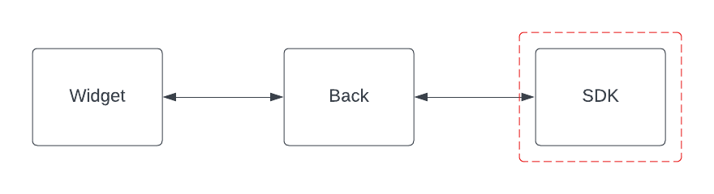

.. ChatFAQ SDK documentation master file, created by
   sphinx-quickstart on Thu Jan 19 10:39:01 2023.
   You can adapt this file completely to your liking, but it should at least
   contain the root `toctree` directive.

SDK's documentation
=======================================

Prerequisites
-------------

- Python 3.10
- python3.10-dev
- python3.10-distutils
- poetry

Installation
------------

Navigate inside :code:`./sdk`

.. module:: sdk

Create a :code:`examples/.env` file with the needed variables set. You can see an example of those on the :ref:`.examples/env_example <sdk_env_example>` file

.. literalinclude:: ../../../../sdk/examples/.env_example

**CHATFAQ_BACKEND_EMAIL** and **CHATFAQ_BACKEND_PASSWORD** should belongs to the created admin user on :doc:`the back-end installation <../back/index>`

Make sure Poetry is using the right Python executable. You have 2 options for this:

    1. If you have the Python executable in your PATH, Poetry will create the virtual environment for you:

    .. code-block:: console

        poetry env use python3.10

    2.- Alternatively, you could use  an environment created with another tool, such as Pyenv or Virtualenv

    .. code-block:: console

        poetry env use /full/path/to/virtualenv/python

Install project dependencies:

.. code-block:: console

    poetry install

Run the example:

.. code-block:: console

    poetry run make run_example

:doc:`concepts`
---------------
