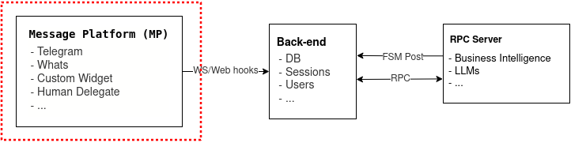

Widget's documentation
=======================================

This is a simple implementation of a client chatbot that connects to ChatFAQ back-end server and offers an interface to communicate with a selected FSM

Prerequisite
---------------------

- node v19.5.0

Install
---------------------

Go inside *./widget* directory and install project dependencies:

.. code-block:: console

    npm i

Configuration
---------------------

Navigate within :code:`./widget`

.. module:: widget

Make a :code:`.env` file with the necessary variables set. The :ref:`.env_example <sdk_env_example>` file contains an example of one of these.

.. literalinclude:: ../../../../widget/.env_example

Development Server
---------------------

Start the development server on http://localhost:3000

.. code-block:: console

    npm run dev

You are all set! Now you can navigate to http://localhost:3000 and test the widget!

+------------------------------------------------------------------+-------------------------------------------------------------------+
|                                                                  |                                                                   |
|.. image:: ../../_static/images/chatbot_widget_closed.png         |.. image:: ../../_static/images/chatbot_widget_closed.png          |
|                                                                  |                                                                   |
|                                                                  |                                                                   |
|                                                                  |                                                                   |
+------------------------------------------------------------------+-------------------------------------------------------------------+

Installation as an external dependency
----------------------------------------------------------

Node server

Via NPM

.. code-block:: console

    npm i chatfaq-widget

Or using UNPKG

.. code-block:: html

    

JS Library

.. code-block:: html

    

    

It is also possible to pass the config keys as data attributes to the mounted element as such:

.. code-block:: html

    

If you declare data attributes and a config object and its keys collide, then the config object will have priority.

Web-Component

.. code-block:: html

    import { ChatfaqWidgetCustomElement } from "chatfaq-widget/dist/widget-loader.esm";

    

    <chatfaq-widget
        data-chatfaq-api="http://127.0.0.1:8000"
        data-chatfaq-ws="ws://127.0.0.1:8000"
        data-fsm-def="simple_fsm"
        data-title="Hello there 👋"
        data-subtitle="How can we help you?"
    ></chatfaq-widget>

Widget params:

**element**: string selector or HTMLElement to which the widget will be attached.

**chatfaqApi**: url of the chatfaq-api.

**chatfaqWs**: url of the chatfaq-ws.

**fsmDef**: name of the fsm-def.

**title**: title which will appear on the header of the chatbot

**subtitle**: subtitle which will appear on the footer of the chatbot
