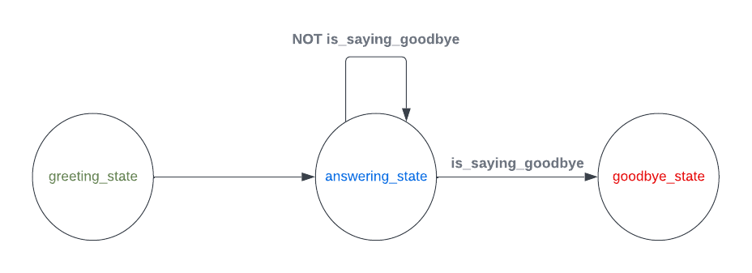

# ChatFAQ's SDK

For those chatbots with complex Finite State Machine (FSM) behaviours, you will probably want to run them on a separate process, that is what for the SDK is made for. Its primary function is to execute the FSM's computations (transition's conditions and states) by running Remote Procedure Call (RPC) server that listen to the back-end requests.


## Prerequisites

Make sure the next list of packages are installed on your system:

- Python 3.10
- python3.10-dev
- python3.10-distutils
- poetry

## Installation

### PYPI

    poetry add chatfaq-sdk

### Local build

#### Set Up:

Install project dependencies:

    poetry install

#### Run

First of all, create a `.env` file with the needed variables set. You can see an example of those on [.env_example](.env_example) file. Next you can see the explanation of each variable:

`CHATFAQ_RETRIEVAL_HTTP`: The address for the HTTP of the back-end server.

`CHATFAQ_BACKEND_WS`: The address for the WS of the back-end server.

`CHATFAQ_TOKEN`: The token to authenticate with the back-end server. You can retrieve the auth token from the backend server:

`curl -X POST -u username:password http://localhost:8000/back/api/login/`


Run the example:

    make run_example

This will run the example FSM that is located in [./examples/model_example/__init__.py](./examples/model_example/__init__.py) file. You can modify this file to test your own FSMs.


### Docker

Alternatively you can simply run the server using docker.

#### Build

    docker build -t chatfaq-sdk .

#### Run

    docker run chatfaq-sdk


## Usage

### Simple example

This is just a dummy example that displays the basic usage of the library.

We are going to build the next FSM:



Import basic modules to build your first FMS:

```python
import os
import random
from chatfaq_sdk import ChatFAQSDK
from chatfaq_sdk.fsm import FSMDefinition, State, Transition
from chatfaq_sdk.conditions import Condition
from chatfaq_sdk.layers import Text
```

Declare the 3 possible states of our FSM:

```python
def send_greeting(ctx: dict):
    yield Text("Hello!")
    yield Text("How are you?", allow_feedback=False)

greeting_state = State(name="Greeting", events=[send_greeting], initial=True)


def send_answer(ctx: dict):
    last_payload = ctx["last_mml"]["stack"][0]["payload"]
    yield Text(
        f'My answer to your message: "{last_payload}" is: {random.randint(0, 999)}'
    )
    yield Text(f"Tell me more")

answering_state = State(
    name="Answering",
    events=[send_answer],
)


def send_goodbye(ctx: dict):
    yield Text("Byeeeeeeee!", allow_feedback=False)

goodbye_state = State(
    name="Goodbye",
    events=[send_goodbye],
)

```

Declare the only computable condition for the transitions of our FSM:

```python
def is_saying_goodbye(ctx: dict):
    if ctx["last_mml"]["stack"][0]["payload"] == "goodbye":
        return Condition(1)
    return Condition(0)
```

Now lets glue everything together:

Declare our transitions

```python
any_to_goodbye = Transition(dest=goodbye_state, conditions=[is_saying_goodbye])

greeting_to_answer = Transition(
    source=greeting_state,
    dest=answering_state,
    unless=[is_saying_goodbye],
)
answer_to_answer = Transition(
    source=answering_state, dest=answering_state, unless=[is_saying_goodbye]
)
```

Build the final instance of our FSM:

```python
fsm_definition = FSMDefinition(
    states=[greeting_state, answering_state, goodbye_state],
    transitions=[greeting_to_answer, any_to_goodbye, answer_to_answer],
)
```

Finally, run the RPC server loop with the previously built FSM:

```python
import os

sdk = ChatFAQSDK(
    chatfaq_retrieval_http="http://localhost:8000",
    chatfaq_ws="ws://localhost:8000",
    token=os.getenv("CHATFAQ_TOKEN"),
    fsm_name="my_first_fsm",
    fsm_definition=fsm_definition,
)
sdk.connect()
```

The resulting FSM looks like this:

## Other useful info
### Build the docs

go inside the `doc` directory and run:

```
poetry run make html
```


### Publish package

#### PYPI test

add repository to poetry config

    poetry config repositories.chatfaq-sdk https://test.pypi.org/legacy/

get token from https://test.pypi.org/manage/account/token/

store token using

    poetry config pypi-token.chatfaq-sdk pypi-YYYYYYYY

#### PYPI production

get token from https://pypi.org/manage/account/token/

store token using

    poetry config pypi-token.chatfaq-sdk pypi-XXXXXXXX

Each time you need to publish

Bump version

    poetry version prerelease

or

    poetry version patch

#### Poetry Publish

To TestPyPi

    poetry publish -r chatfaq-sdk

To PyPi

    poetry publish
